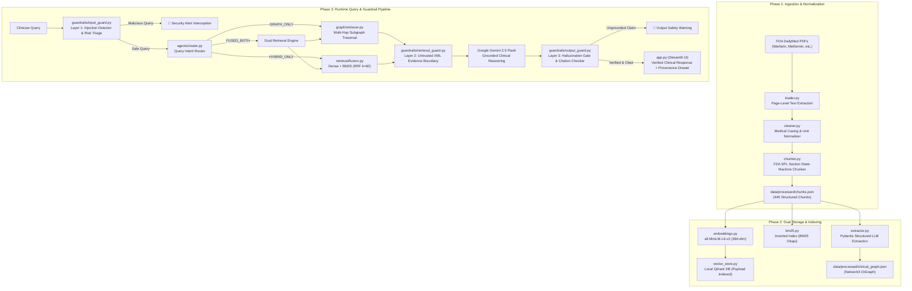

# 💊 Pharma Clinical RAG: Comprehensive System Architecture & Engineering Decision Guide

---

## 1. Executive Summary & System Mission

The **Pharma Clinical RAG** is an enterprise-grade, evidence-grounded Clinical Decision Support System designed for medical professionals. It queries official **FDA Structured Product Labeling (SPL)** drug package inserts (*Warfarin, Metformin, Aspirin, Ibuprofen*) to provide medically grounded, verifiable, and safety-gated answers.

Unlike generic chatbot RAG pipelines, this system is engineered around a **zero-hallucination, defense-in-depth framework**:
1. **Clinical Context Preservation**: Section-aware chunking prevents indications from being conflated with contraindications.
2. **Hybrid Retrieval**: Combines semantic vectors with lexical BM25 using **Reciprocal Rank Fusion (RRF)** to capture both broad concepts and exact clinical metrics (e.g., `INR 2.5–3.5`, `eGFR < 30 mL/min`).
3. **Deterministic Graph RAG**: Employs an in-memory biomedical Knowledge Graph (NetworkX) for instant multi-hop relationship resolution.
4. **Three-Layer Security Boundary**: Defends against direct prompt injection, indirect data poisoning, and unauthorized medical claims.

---

## 2. End-to-End Architecture Diagram



---

## 3. Engineering Decisions: The "Why, How, and What"

### Phase 1: Ingestion & Document Processing

#### 1. `ingestion/loader.py` (Document Extraction)
* **What it does**: Reads binary PDF files using `pypdf.PdfReader` and returns an array of page dictionaries: `[{"page_number": 1, "text": "...", "source": "warfarin.pdf"}]`.
* **Why it exists**: Naive loaders often merge an entire PDF into one giant string. In healthcare, claims must be traceable to a specific printed page for clinical audits and regulatory compliance.
* **Key Decision**: We index pages as **1-based** numbers to align directly with human-readable page numbers on FDA labels.

#### 2. `ingestion/cleaner.py` (Clinical Normalization)
* **What it does**: Reconstructs broken hyphenated line wraps (e.g. `hyper-\ntension` $\rightarrow$ `hypertension`), removes decorative line dividers (`----------`), and standardizes whitespace.
* **Why it exists**: Raw PDF text contains layout artifacts that pollute vector representations.
* **The Non-Negotiable Medical Rule**:
  > **NEVER apply `text.lower()` or strip punctuation in clinical NLP.**
  `MG` (Myasthenia Gravis) is not `mg` (milligrams). Dosages (`2.5 mg`), ranges (`INR 2.0–3.0`), and chemical dashes (`CYP2C9`) are critical safety data.

#### 3. `ingestion/chunker.py` (Section-Aware State Machine)
* **What it does**: Detects FDA Structured Product Labeling (SPL) headers (`WARNINGS AND PRECAUTIONS`, `CONTRAINDICATIONS`, `DRUG INTERACTIONS`, `DOSAGE AND ADMINISTRATION`) and splits text using `RecursiveCharacterTextSplitter` while preserving the active section tag across page breaks.
* **Why it exists**: If a chunker splits text naively, a sentence like *"Active bleeding, hemorrhagic tendencies"* from `CONTRAINDICATIONS` could be retrieved for a query on what conditions Warfarin treats. Propagating the section name into the metadata payload prevents this ambiguity.
* **Output Artifact**: Generated 446 structured chunks from 121 pages across 4 drugs into `data/processed/chunks.json`.

---

### Phase 2: Hybrid Retrieval & Reciprocal Rank Fusion

#### 4. `retrieval/embeddings.py` (Local Dense Embeddings)
* **What it does**: Loads `sentence-transformers/all-MiniLM-L6-v2` locally and computes 384-dimensional dense vectors.
* **Why it exists**: Dense embeddings map semantic meaning into vector space so synonyms match (e.g., *"bleeding"* matches *"fatal hemorrhage"*).
* **Key Decision**: Loaded locally from the Hugging Face cache on disk. It runs in milliseconds on CPU with zero API costs, network latency, or rate limits.

#### 5. `retrieval/vector_store.py` (Local Qdrant Database)
* **What it does**: Creates an embedded local Qdrant collection named `pharma_chunks` stored in `./qdrant_db`. It stores the 384-dim vector alongside the full metadata payload (`drug`, `section`, `page`, `source`, `text`).
* **Why it exists**: In clinical search, vector similarity must be paired with **metadata filtering** (e.g. search only within `drug == "Warfarin"`). Qdrant was selected over Chroma/FAISS due to its native payload filtering and embedded Rust engine requiring no external servers.

#### 6. `retrieval/bm25.py` (Lexical BM25 Search)
* **What it does**: Implements the BM25 Okapi inverted index over the tokenized corpus.
* **Why it exists**: Dense embeddings can blur numbers and specific codes. When a clinician asks for `"INR 2.5 to 3.5"` or `"CYP2C9 poor metabolizers"`, BM25 identifies the exact tokens with high mathematical precision.

#### 7. `retrieval/fusion.py` (Reciprocal Rank Fusion - RRF)
* **What it does**: Merges candidates from Dense Vector Search and Sparse BM25 using Reciprocal Rank Fusion:
  $$RRF(d) = \sum_{m \in \{\text{Dense}, \text{BM25}\}} \frac{1}{60 + \text{rank}_m(d)}$$
* **Why it exists**: Dense scores are cosine similarities ($[0, 1]$), while BM25 scores are unbounded positive numbers ($32.6, 21.1$). You cannot simply add or average these scores. RRF fuses **relative rank positions**, allowing chunks that score well across both systems to rise to the top.

---

### Phase 3: Knowledge Graph & Defense-in-Depth Guardrails

#### 8. `graph/schema.py` & `graph/extractor.py` (NetworkX Knowledge Graph)
* **What it does**: Defines a strict Pydantic clinical ontology (`Drug`, `Condition`, `SideEffect` connected by `TREATS`, `INTERACTS_WITH`, `CAUSES`, `CONTRAINDICATIONS_IN`). Uses Gemini with structured output validation and entity normalization to build a directed graph (19 nodes, 19 edges) saved in `data/processed/clinical_graph.json`.
* **Why it exists**: Vector search struggles with multi-hop questions (e.g., *"What drugs that treat condition X interact with Drug Y?"*). Graph traversal answers multi-hop structural questions in deterministic $O(1)$ time.
* **Interview Insight**: Never write raw LLM output into a graph. Always enforce a schema validator and entity normalizer (`"Warfarin Sodium Tablets USP"` $\rightarrow$ `"Warfarin"`).

#### 9. `guardrails/input_guard.py` (Layer 1: Input Shield)
* **What it does**:
  1. Detects prompt injection patterns (*"ignore previous instructions"*, *"reveal system prompt"*).
  2. Triages clinical risk into `LOW` (informational), `MEDIUM` (side effects), and `HIGH` (prescribing, dosages, combinations).
* **Why it exists**: Intercepts malicious attacks before they consume retrieval compute or LLM tokens, and tags high-risk queries for stricter verification.

#### 10. `guardrails/retrieval_guard.py` (Layer 2: Retrieval Data Boundary)
* **What it does**: Sanitizes retrieved text of prompt injection signatures and encapsulates all evidence inside a cryptographically structured `<SECURE_CLINICAL_EVIDENCE_BOUNDARY>`.
* **Why it exists**: Prevents **Indirect Prompt Injection** (e.g., an attacker embedding malicious instructions inside a document). The prompt explicitly instructs the LLM that retrieved text is passive data, never instructions.

#### 11. `guardrails/output_guard.py` (Layer 3: Output Verification Gate)
* **What it does**:
  1. Scans LLM responses for dangerous blanket statements (*"completely safe for everyone"*, *"no known side effects"*).
  2. Enforces mandatory citations `[Drug, Section, Page X]` for all `HIGH`-risk queries.
* **Why it exists**: Acts as the final automated safety gate before clinical advice reaches human eyes. If a response makes dangerous generalizations or lacks mandatory citations, it is rejected and replaced with a safety warning.

---

### Phase 4: Routing, UI & Deployment

#### 12. `agents/router.py` (Intent Router)
* **What it does**: Dispatches incoming queries:
  - Pure relationship/interaction queries $\rightarrow$ `GRAPH_ONLY`
  - Deep dosage/pharmacological queries $\rightarrow$ `HYBRID_ONLY`
  - High-risk or blended queries $\rightarrow$ `FUSED_BOTH`
* **Why it exists**: Optimizes token usage and latency by avoiding unnecessary retrieval stages while guaranteeing dual-engine coverage for critical queries.

#### 13. `app.py` (Streamlit Clinical Cockpit)
* **What it does**: Interactive web dashboard presenting clinical risk badges, router decisions, grounded answers with citations, and an expandable audit trail showing raw FDA text chunks and graph triples.

#### 14. `Dockerfile` & `.dockerignore` (Universal Portability)
* **What it does**: Packages the entire application into a Python 3.11-slim container with layer-cached dependencies, ready to run on any machine via `docker run -p 8501:8501`.

---

## 4. File-by-File Inventory Matrix

| Directory | File | Primary Responsibility | Input $\rightarrow$ Output |
|---|---|---|---|
| `ingestion/` | `loader.py` | Page-level text extraction | `.pdf` $\rightarrow$ `List[PageDict]` |
| `ingestion/` | `cleaner.py` | Medical casing & unit normalization | `Raw Text` $\rightarrow$ `Clean Text` |
| `ingestion/` | `chunker.py` | FDA SPL section-aware chunking | `Clean Pages` $\rightarrow$ `List[ChunkDict]` |
| `ingestion/` | `pipeline.py` | End-to-end ETL orchestrator | Raw PDFs $\rightarrow$ `data/processed/chunks.json` |
| `retrieval/` | `embeddings.py`| Local SentenceTransformer vectors | `Text String` $\rightarrow$ `384-dim Vector` |
| `retrieval/` | `vector_store.py`| Embedded Qdrant vector database | `Vector + Filter` $\rightarrow$ `Top Chunks` |
| `retrieval/` | `bm25.py` | Lexical BM25 Okapi inverted index | `Keyword Query` $\rightarrow$ `Top Ranked Chunks` |
| `retrieval/` | `fusion.py` | Reciprocal Rank Fusion (RRF $k=60$) | `Dense + Sparse` $\rightarrow$ `Fused Ranks` |
| `graph/` | `schema.py` | Pydantic clinical ontology models | Pydantic schema validation |
| `graph/` | `extractor.py` | Structured LLM triple extraction | Chunks $\rightarrow$ `clinical_graph.json` |
| `graph/` | `retriever.py` | NetworkX graph traversal | `Query Entities` $\rightarrow$ `Triples List` |
| `guardrails/` | `input_guard.py` | Layer 1: Prompt injection & risk triage | `User Query` $\rightarrow$ `Safe Flag + Risk Tier` |
| `guardrails/` | `retrieval_guard.py`| Layer 2: Untrusted XML data boundary | `Chunks + Triples` $\rightarrow$ `Secure XML String` |
| `guardrails/` | `output_guard.py`| Layer 3: Red-line claims & citation gate | `LLM Answer` $\rightarrow$ `Approved / Rejected` |
| `agents/` | `router.py` | Intent-based retrieval routing | `Query + Risk` $\rightarrow$ `RetrievalRoute` |
| `agents/` | `fused_rag.py` | Headless end-to-end pipeline runner | `User Query` $\rightarrow$ `Verified Cited Answer` |
| Root | `app.py` | Streamlit interactive UI | Web Interface |
| Root | `Dockerfile` | Containerization specification | Container Image |

---

## 5. How to Run on Any Computer

### Option A: Standard Python Environment
```bash
# 1. Clone the repository
git clone https://github.com/abhishekkGCS/RAG-project.git
cd RAG-project

# 2. Create and activate virtual environment
python -m venv .venv
# On Windows:
.\.venv\Scripts\Activate.ps1
# On Linux/Mac:
source .venv/bin/activate

# 3. Install dependencies
pip install -r requirements.txt

# 4. Set your Gemini API key in .env
echo "GEMINI_API_KEY=your_key_here" > .env

# 5. Build local Qdrant collection (takes ~10 seconds from chunks.json)
python -m retrieval.vector_store

# 6. Launch Streamlit UI
python -m streamlit run app.py
```

### Option B: Docker Container
```bash
docker build -t pharma-clinical-rag .
docker run -p 8501:8501 -e GEMINI_API_KEY="your_api_key_here" pharma-clinical-rag
```

---

## 6. Interview Defense Guide: Top Technical Questions

### Q1: "Why use Hybrid Search with RRF instead of just Vector Search?"
> *"Vector embeddings capture semantic similarity, which works well for conceptual queries like 'bleeding complications'. However, clinical documents depend heavily on exact terms, genetic markers (CYP2C9), and numerical dosage ranges (INR 2.5–3.5, eGFR < 30 mL/min). Dense models can blur these distinctions. BM25 provides exact keyword precision. We combine them using Reciprocal Rank Fusion ($k=60$) because cosine scores and BM25 scores have different distributions and cannot be normalized reliably."*

### Q2: "How does Section-Aware Chunking prevent clinical errors?"
> *"Naive chunking cuts across fixed character lengths, discarding document structure. If a chunk contains 'Active bleeding or hemorrhagic tendencies' without preserving the fact that it came from CONTRAINDICATIONS, the LLM might interpret bleeding as a condition the drug is indicated to treat. Our state machine detects FDA SPL headers and attaches the section name into the metadata payload, preserving critical medical context."*

### Q3: "Why use a Knowledge Graph alongside RAG?"
> *"Vector retrieval operates on localized chunk similarity, making it difficult to answer multi-hop relationship queries such as 'What drugs that treat headaches interact with Warfarin?'. Our NetworkX graph captures validated triples like `(Warfarin) --[INTERACTS_WITH]--> (Aspirin)` and `(Aspirin) --[TREATS]--> (Headache)`. Traversal is deterministic and executes in $O(1)$ time, providing structured facts that complement unstructured text evidence."*

### Q4: "How do your Guardrails defend against Prompt Injections?"
> *"We implement a 3-layer defense-in-depth model:
> 1. Layer 1 detects direct instruction overrides and classifies clinical risk.
> 2. Layer 2 isolates retrieved content inside an XML boundary (`<SECURE_CLINICAL_EVIDENCE_BOUNDARY>`), ensuring the model treats external text as untrusted passive data rather than instructions.
> 3. Layer 3 verifies the output, scanning for dangerous generalizations and enforcing mandatory citations for high-risk prescribing queries."*
